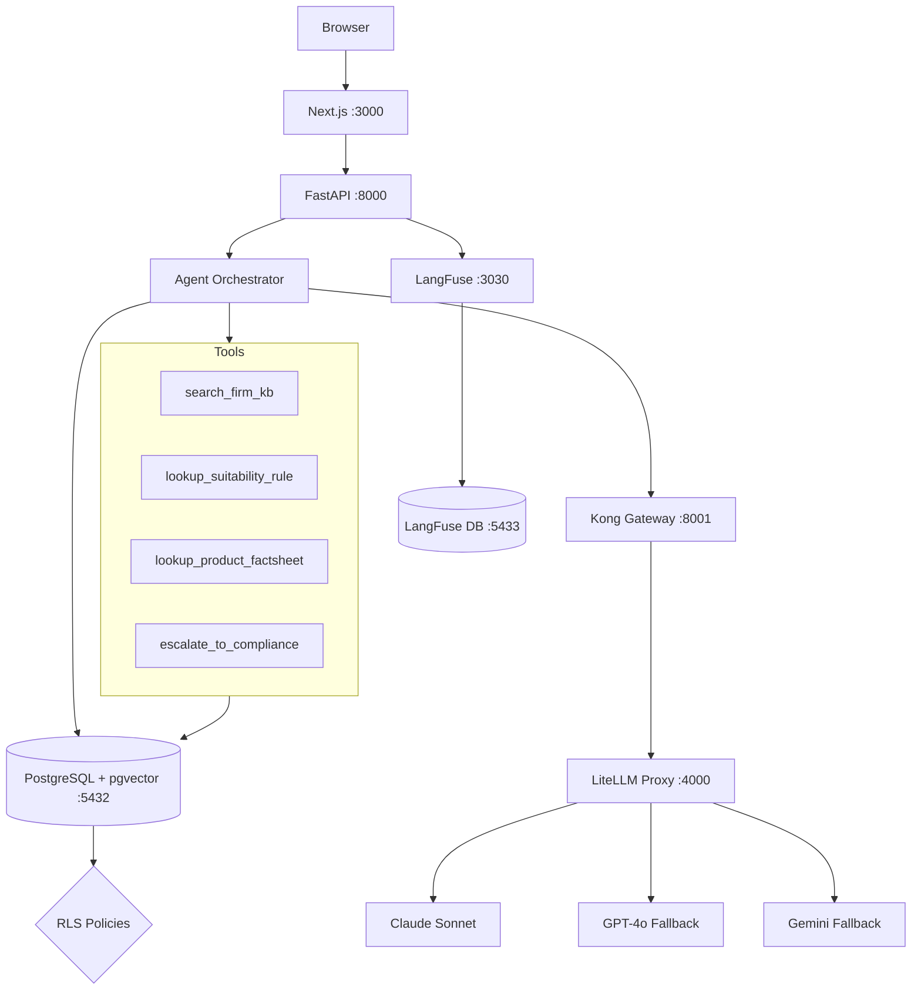

# FinAdvisor

**Compliance-Aware Wealth Advisor RAG Assistant**

A full-stack AI advisory system that provides compliance-scoped financial product recommendations with citations, jurisdiction enforcement, and tier-based access control.

## Architecture



### Request Flow

```
User (browser)
  -> Next.js (:3000) -- renders UI, streams SSE
    -> FastAPI (:8000) -- JWT verify, audit log, SSE endpoint
      -> Agent Orchestrator -- ReAct loop, tool calls
        -> pgvector (RLS-filtered similarity search)
        -> Kong (:8001) -- token budget, rate limiting
          -> LiteLLM (:4000) -- model routing + fallback
            -> Claude / GPT-4o / Gemini
      -> LangFuse (:3030) -- trace emitted per turn
```

## Tech Stack

| Layer | Technology |
|-------|-----------|
| Backend | Python 3.12, FastAPI, SQLAlchemy 2.x async |
| Database | PostgreSQL 16 + pgvector (1024-dim, RLS) |
| Embeddings | Voyage AI (voyage-3) |
| Agent | Anthropic SDK (ReAct loop, 4 tools) |
| LLM Gateway | LiteLLM + Kong (rate limit, fallback chain) |
| Observability | LangFuse (self-hosted, trace per query) |
| Frontend | Next.js 14, Tailwind CSS, zustand |
| IaC | Terraform (GCP Cloud Run, Cloud SQL) |
| CI | GitHub Actions (lint + eval gate) |

## Key Features

- **Row-Level Security (RLS)** -- PostgreSQL enforces tier and jurisdiction access at the database level. No application-level filtering.
- **Citation System** -- Every claim has a `[N]` citation mapping to retrieved source chunks with regulatory references.
- **Stale Document Warnings** -- Documents older than 12 months get an orange "STALE" badge in the UI.
- **PII Redaction** -- Ingest pipeline redacts PII before embedding. Output pass catches LLM-hallucinated PII.
- **Eval Gate** -- 50 golden Q&A pairs scored by LLM-as-judge. CI blocks if citation_accuracy < 95% or faithfulness < 90%.
- **Fallback Chain** -- Claude -> GPT-4o -> Gemini with circuit breaker pattern via LiteLLM.

## Mock Users

| User | Tier | Level | Jurisdictions | Licenses |
|------|------|-------|---------------|----------|
| Sarah Chen | senior | 3 | US | Series-7, Series-66 |
| Alex Kim | associate | 1 | EU | MiFID-II |
| James Wright | private_wealth | 4 | UK | FCA |
| Priya Sharma | advisor | 2 | US, EU | Series-7, MiFID-II |

## Quick Start

### Prerequisites

- Python 3.12+
- Node.js 20 LTS
- Docker Desktop **running** (for PostgreSQL)
- API keys: `ANTHROPIC_API_KEY`, `VOYAGE_API_KEY`

### One-Command Launch

```bash
# 1. Install via Poetry (one time, from project root)
poetry install

# 2. Create backend/.env with your API keys
#    ANTHROPIC_API_KEY=sk-ant-...
#    VOYAGE_API_KEY=pa-...

# 3. Start everything
poetry run finadvisor
```

`poetry run finadvisor` handles everything automatically:
- Checks Docker is running (warns if not)
- Starts PostgreSQL + pgvector container
- Applies database schema (if first run)
- Ingests 50 synthetic documents with embeddings (if first run, costs ~$0.01 via Voyage AI)
- Starts the FastAPI backend on `:8000`
- Installs frontend deps and starts Next.js on `:3000`
- Connects directly to Anthropic API (no gateway needed)

After first run, starting the app consumes **zero API tokens**. LLM tokens are only used when you ask questions in the chat.

### Sample Questions to Try

1. **Select Sarah Chen** (US Senior, tier 3) and ask:
   > "Is the Meridian Core Bond Fund suitable for a conservative retiree?"
   
   You'll see tool calls (`search_firm_kb`, `lookup_suitability_rule`), citation badges `[1]` `[2]` with FINRA references, and US-only results.

2. **Switch to Alex Kim** (EU Associate, tier 1) and ask:
   > "What US Treasury products can I recommend?"
   
   The agent refuses -- US is outside Alex's jurisdiction. Then ask:
   > "What EU fixed-income products are available?"
   
   This works -- returns EU products with MiFID II citations.

### Manual Setup (Alternative)

```bash
# Start PostgreSQL
docker compose up -d postgres

# Backend setup
cd backend
pip install -e ".[dev]"
psql -h localhost -U finadvisor -d finadvisor -f db/schema.sql
python scripts/ingest.py
uvicorn src.main:app --reload

# Frontend (new terminal)
cd frontend
npm install
npm run dev

# Open http://localhost:3000
```

### Key Commands

```bash
# Quality gate (run after every change)
cd backend
ruff check . --fix && ruff format . && mypy src/ && pytest tests/ -v

# Run eval set
python scripts/run_eval.py --eval-set ../data/eval/golden_qa.json

# Start LangFuse (optional)
docker compose -f langfuse/docker-compose.langfuse.yml up -d
# Open http://localhost:3030 (admin@finadvisor.local / admin123)

# Frontend lint + build
cd frontend
npm run lint && npm run build

# Stop everything
# Ctrl+C in the finadvisor terminal, then:
docker compose down
```

## Project Structure

```
finadvisor/
  backend/           Python 3.12 FastAPI backend
    src/
      agent/          ReAct orchestrator, tools, system prompt
      api/            FastAPI routes, SSE streaming
      auth/           JWT auth, mock users
      db/             SQLAlchemy models, RLS helpers
      observability/  structlog config, LangFuse tracing
      pii/            PII redaction (GCP DLP + regex fallback)
      retrieval/      Voyage embeddings, vector store
    scripts/          Ingest, corpus gen, eval runner
    tests/            120+ tests (unit, integration, e2e)
  frontend/          Next.js 14 chat UI
    src/
      components/     ChatWindow, CitationPanel, UserSwitcher
      hooks/          useChat (SSE), useUser (zustand)
      lib/            API client, citation parser
  terraform/         GCP infrastructure-as-code
  data/
    corpus/           50 synthetic financial documents
    eval/             50 golden Q&A pairs + judge prompt
  langfuse/           Self-hosted LangFuse compose
  kong/               API gateway config
  litellm/            LLM proxy config
```

## Documentation

- [ARCHITECTURE.md](ARCHITECTURE.md) -- Complete design reference
- [TODO.md](TODO.md) -- Task tracker with progress log
- [docs/demo_script.md](docs/demo_script.md) -- Demo recording walkthrough
- [docs/threat_model.md](docs/threat_model.md) -- Security considerations

## License

Private -- Interview project for demonstration purposes.
